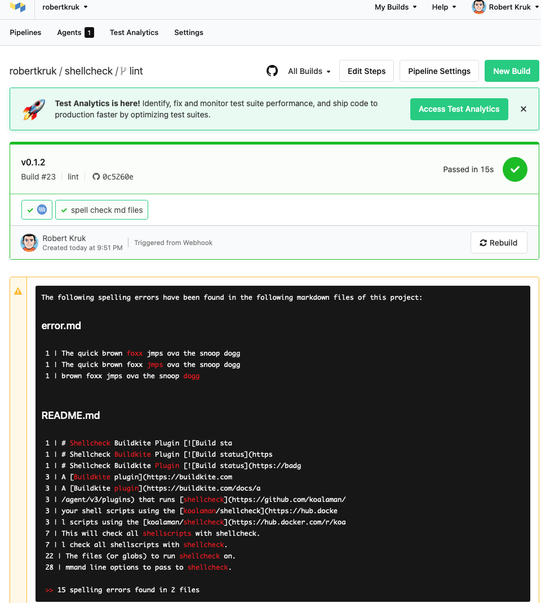

# spell-checker-buildkite-plugin

A test Buildkite plugin to check Markdown files for any  spelling errors utilising the docker image [tmaier/markdown-spellcheck](https://hub.docker.com/r/tmaier/markdown-spellcheck)

## Example Pipeline Steps

```yaml
steps:
  - plugins:
    - robertkruk/spell-checker#v0.1.5:
        pattern: '*.md'
```

When I run the build, I get the following :

 